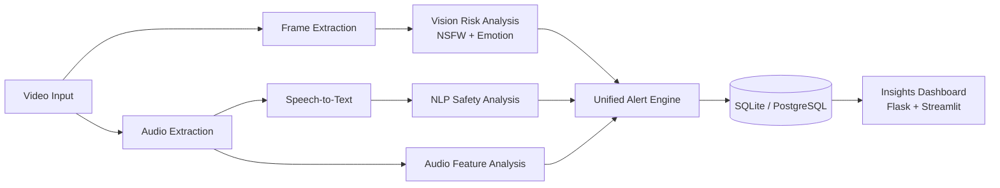

# MelodyWings Guard

<p align="center">
  <a href="#"></a>
  <a href="#"></a>
  <a href="#"></a>
  <a href="#"></a>
  <a href="#"></a>
</p>

Multimodal content-safety platform that analyzes **video, audio, and text** end-to-end.  
It turns raw media into structured moderation intelligence using a pipeline of computer vision, speech recognition, NLP, alert scoring, and dashboard analytics.

---

## 🎯 Project Overview

### What the Video Analyzer Does

MelodyWings Guard processes uploaded video content and automatically identifies potential safety risks. It combines:

- **Visual analysis** of sampled frames (NSFW + emotion signals)
- **Audio behavior analysis** (volume, silence, speech rate, speaker-change heuristics)
- **Speech-to-text transcription** from extracted audio
- **NLP moderation** on transcript text (toxicity, profanity, PII, sentiment, entity checks)
- **Unified alerting + storage** with severity, confidence, and category metadata

### Core Pipeline

**Video → Audio → Text → Insights**

1. Ingest video file
2. Extract frames and audio
3. Transcribe speech into text
4. Run NLP moderation and multimodal risk checks
5. Generate risk insights, alerts, and dashboard-ready analytics

---

## 🆕 Latest Improvements (New)

### 1) Model Performance Improvements

- Added **batch NSFW inference** to reduce model call overhead and improve throughput
- Introduced **temporal NSFW smoothing (EMA)** + **consecutive confirmation logic** to reduce noisy spikes
- Added **high-confidence bypass** for critical NSFW frames to preserve sensitivity on strong signals
- Improved transcript safety classification with **segment-level confidence-aware NLP checks**

### 2) Enhanced Preprocessing & Feature Extraction

- Added frame preprocessing pipeline:
  - adaptive resize for faster inference
  - optional CLAHE contrast normalization
- Added frame quality gating for emotion analysis:
  - blur variance checks
  - brightness checks
  - optional face-region-first emotion inference
- Upgraded audio analysis heuristics for:
  - loudness anomalies
  - silence pattern detection
  - speech-rate agitation signals
  - speaker-change estimation

### 3) Improved Pipeline Integration

- Introduced **shared audio extraction payload** reused across video, transcript, and audio analyzers
- Added robust transcription fallback chain:
  - Whisper (primary)
  - chunked SpeechRecognition fallback with overlap merging
- Added run-level traceability with **`run_id`** propagation across all alert tables

### 4) New / Upgraded AI-ML Models

- **Transformers**:
  - `unitary/toxic-bert` for toxicity
  - `distilbert-base-uncased-finetuned-sst-2-english` for sentiment
  - `openai/whisper-base` (configurable) for speech-to-text
- **Vision models**:
  - `Falconsai/nsfw_image_detection` for frame safety
  - `DeepFace` emotion inference (CNN-based facial feature extraction)
- **NLP enrichment**:
  - spaCy `en_core_web_sm` for entity extraction

### 5) Scalability & Optimization Upgrades

- Batch processing for frame inference and chat NLP operations
- Transcript chunking for long-text robustness and memory-safe processing
- Database write optimization with batched commits
- Optional PostgreSQL backend support for scale-out persistence
- Short-lived dashboard caching to improve API response performance

---

## ✨ Features

### Core Features

- Video frame extraction and analysis
- NSFW detection with confidence scoring
- Emotion-to-sentiment mapping for visual behavior
- Audio extraction and speech transcription
- Transcript moderation using NLP safety pipeline
- Alert engine with severity and category classification
- Local persistence with relational schema and drill-down joins

### Advanced Features

- Temporal stabilization for NSFW decisions
- Face-aware, quality-aware emotion detection
- Long transcript segmentation with confidence metadata
- Evaluation utilities:
  - confusion matrix generation
  - accuracy / precision / recall / F1 metrics
- Dual dashboards:
  - Streamlit analytics console
  - Flask + custom HTML operations dashboard
- CSV/JSON export and rich filtering for investigation workflows

---

## 🧰 Tech Stack

| Layer | Technologies |
|---|---|
| Frontend | HTML5, CSS3, JavaScript, Chart.js |
| Dashboard/UI | Streamlit, Flask templates |
| Backend | Python, Flask API endpoints |
| AI/ML (NLP) | Hugging Face Transformers, spaCy, better-profanity |
| AI/ML (Vision) | OpenCV, DeepFace, NSFW image classifier |
| AI/ML (Speech/Audio) | Whisper pipeline, SpeechRecognition, librosa, pydub |
| Database | SQLite (default), PostgreSQL (optional) |
| Data/Plots | pandas, NumPy, Plotly |
| Testing | unittest |
| Dev Tools | VS Code, pip/venv, ffmpeg |

---

## 🏗️ System Architecture

### Pipeline Flow

**Video Input → Frame Extraction → Audio Extraction → Speech-to-Text → NLP → Insights**



---

## ⚙️ Installation Guide (VS Code Friendly)

### Prerequisites

- Python **3.10+**
- Git
- ffmpeg installed on system PATH

Install ffmpeg:

- Windows: `winget install ffmpeg`
- macOS: `brew install ffmpeg`
- Ubuntu/Debian: `sudo apt install ffmpeg`

### Setup Steps

```bash
# 1) Clone repository
git clone <your-repo-url>
cd melodywings_guard

# 2) Create virtual environment
python -m venv .venv

# 3) Activate virtual environment
# Windows PowerShell
.\.venv\Scripts\Activate.ps1

# macOS/Linux
source .venv/bin/activate

# 4) Install dependencies
pip install -r requirements.txt

# 5) Install spaCy model
python -m spacy download en_core_web_sm
```

---

## ▶️ Usage

### 1) Run Full Pipeline

```bash
python main.py
```

What this run performs:

1. Chat moderation on sample messages
2. Video frame analysis (NSFW + emotion)
3. Audio extraction and speech transcription
4. Transcript NLP safety analysis
5. Audio feature anomaly analysis
6. Alert persistence + summary metrics
7. Confusion matrix export for chat evaluation

### 2) Launch HTML Dashboard

```bash
python html_dashboard.py
```

Open: **http://localhost:8502**

### 3) Launch Streamlit Dashboard

```bash
streamlit run dashboard.py
```

### 4) Run Tests

```bash
python test_chat_analyzer.py
python test_video_analyzer.py
```

### Notes

- Update `VIDEO_PATH` in `main.py` to your local video file before running full video analysis.
- Output artifacts include:
  - `melodywings_guard.db`
  - `melodywings_guard.log`
  - `chat_confusion_matrix.html`

---

## 📁 Project Structure

```text
melodywings_guard/
├── alert_engine.py              # Unified alert logger and severity mapping
├── audio_analyzer.py            # Audio feature extraction and anomaly rules
├── chat_analyzer.py             # NLP moderation (toxicity, PII, sentiment, entities)
├── dashboard.py                 # Streamlit analytics dashboard
├── database.py                  # SQLite/PostgreSQL adapter and schema layer
├── html_dashboard.py            # Flask API + custom HTML dashboard server
├── main.py                      # Pipeline orchestrator entry point
├── video_analyzer.py            # Frame/video/transcript analysis pipeline
├── requirements.txt             # Python dependencies
├── test_chat_analyzer.py        # Unit tests for chat analyzer
├── test_video_analyzer.py       # Unit tests for video analyzer
├── alerts_log.json              # Alert export/log artifact
├── analysis_output.txt          # Pipeline run output artifact
├── chat_confusion_matrix.html   # Chat evaluator visualization artifact
├── static/
│   ├── dashboard.css            # HTML dashboard styling
│   └── dashboard.js             # HTML dashboard frontend logic
└── templates/
    └── dashboard.html           # HTML dashboard template
```

---

## 📊 Performance Metrics

### Current Measured Results

| Metric | Current Value | Source |
|---|---:|---|
| Chat Accuracy | **1.00** | `chat_confusion_matrix.html` (TN=5, FP=0, FN=0, TP=5) |
| Chat Precision | **1.00** | Same evaluation set |
| Chat Recall | **1.00** | Same evaluation set |
| Chat F1-score | **1.00** | Same evaluation set |
| Video Effective FPS | **4.56 to 7.55** (avg **6.3**) | Historical run logs |
| Approx. Per-frame Latency | **132 ms to 219 ms** | Derived from effective FPS |

### Improvements Over Previous Iterations

- Frame false-positive behavior improved significantly in logged runs:
  - earlier worst-case observed: **180/256 flagged (70.31%)**
  - recent tuned runs: **0 to 1/256 flagged (0.00% to 0.39%)**
- Throughput stabilized with batched frame inference and optimized preprocessing
- End-to-end pipeline now reports structured runtime telemetry for continuous tuning

### Metrics Tracked Per Run

- Accuracy / Precision / Recall / F1 (chat, optional video GT)
- Frame stage runtime and effective FPS
- Average frame processing latency
- NSFW and emotion inference timing
- Transcript stage runtime and flagged-segment count

---

## 🚀 Future Enhancements

- Real-time stream ingestion (WebRTC/RTSP/WebSocket pipelines)
- Stronger multimodal models (action/context-aware risk detection)
- Optional LSTM or temporal transformers for sequence-level behavior modeling
- Better explainability for why an item was flagged
- Enhanced UI with analyst workflows, saved views, and triage queues
- Containerized deployment (Docker + CI/CD)
- Cloud deployment profiles (Azure/AWS/GCP)

---

## 🤝 Contributing

Contributions are welcome.

1. Fork the repository
2. Create a feature branch: `git checkout -b feature/your-feature`
3. Commit your changes: `git commit -m "Add: your feature"`
4. Push branch: `git push origin feature/your-feature`
5. Open a Pull Request with:
   - problem statement
   - implementation summary
   - test evidence/screenshots

### Contribution Guidelines

- Keep changes modular and well-documented
- Add or update tests for logic changes
- Preserve backwards compatibility where possible
- Follow existing code style and naming conventions

---

## 📜 License

This project is intended for educational, hackathon, and portfolio use.

Recommended open-source license: **MIT License**.

---

## 🙌 Acknowledgements

- Hugging Face Transformers ecosystem
- OpenCV and DeepFace communities
- spaCy NLP ecosystem
- Streamlit and Flask maintainers
