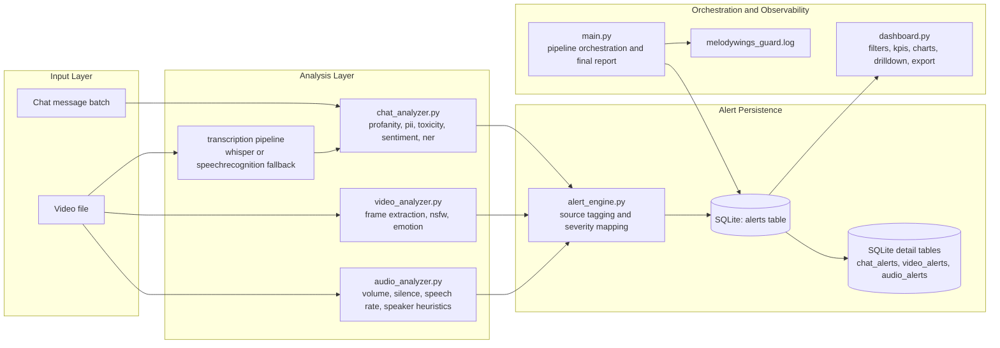

# MelodyWings Guard

Real-time multimodal content safety pipeline for chat and video moderation.

## What This Project Does

MelodyWings Guard analyzes four signal streams:

1. Chat messages: profanity, PII, toxicity, sentiment, entities.
2. Video frames: NSFW classification and dominant emotion detection.
3. Video transcript: audio transcription followed by the same chat safety pipeline.
4. Audio features: loudness, silence patterns, speech rate, and speaker-change heuristics.

All alerts are persisted to SQLite and visualized in an interactive Streamlit dashboard.

## Architecture Diagram



## Core Components

| File | Responsibility |
|---|---|
| main.py | Entry point. Initializes DB, runs chat/video/audio analysis, prints final report. |
| chat_analyzer.py | Message-level safety checks using rules and transformer models. |
| video_analyzer.py | Frame sampling, NSFW/emotion checks, transcript extraction and transcript chunk analysis. |
| audio_analyzer.py | Audio-level behavioral feature extraction and rule-based flagging. |
| alert_engine.py | Normalized alert logging with source-specific writers. |
| database.py | SQLite schema creation, inserts, aggregate stats, and joined detailed retrieval. |
| dashboard.py | Full operational dashboard with advanced filters, analytics, drilldown, and export. |

## Data Model (SQLite)

Primary table:

1. alerts: one row per alert/event with source, severity, confidence, category, timestamp, and message.

Detail tables:

1. chat_alerts: profanity/PII/toxicity/sentiment/entity details.
2. video_alerts: frame index, timestamp_sec, NSFW label/score, emotion.
3. audio_alerts: volume stats, silence count, speech rate, background noise, speaker count.
4. transcript_segments: reserved table for segment-level transcript confidence tracking.

Database file:

1. melodywings_guard.db

## Prerequisites

1. Python 3.10+
2. ffmpeg available on PATH

Install ffmpeg:

1. Windows: winget install ffmpeg
2. macOS: brew install ffmpeg
3. Linux (Debian/Ubuntu): sudo apt install ffmpeg

## Installation

1. Open terminal in the project folder.
2. Create and activate a virtual environment.
3. Install dependencies.
4. Install spaCy model.

```bash
python -m venv .venv

# Windows PowerShell
.\.venv\Scripts\Activate.ps1

# macOS/Linux
source .venv/bin/activate

pip install -r requirements.txt
python -m spacy download en_core_web_sm
```

## Run The Pipeline

```bash
python main.py
```

Execution stages:

1. Analyze SAMPLE_MESSAGES in main.py.
2. Analyze video frames and transcript when VIDEO_PATH exists.
3. Run audio feature analysis when audio extraction succeeds.
4. Persist all records to SQLite.
5. Print severity/source summary in terminal.

Note:

1. main.py currently uses an absolute VIDEO_PATH. Update that path in main.py or keep a valid file at the configured location.

## Run The Dashboard

```bash
streamlit run dashboard.py
```

Dashboard capabilities:

1. KPI row: scanned, flagged, safe, flag rate, high/critical counts.
2. Multi-dimensional filters: source, flagged status, severity, category, reason tags, sentiment, emotion, confidence range, date range, and text search.
3. Analytics visuals: source distribution, severity split, reason breakdown, time trend.
4. Drilldown: record-level details for chat/transcript/video/audio fields.
5. Export: filtered CSV and JSON downloads.
6. Auto-refresh and manual refresh controls.

## Configuration Reference

Static thresholds in code:

1. chat_analyzer.py: TOXICITY_THRESHOLD = 0.75
2. chat_analyzer.py: strong negative sentiment flag threshold = 0.98
3. video_analyzer.py: NSFW_THRESHOLD = 0.70
4. video_analyzer.py: FLAGGED_EMOTIONS = fear, disgust, sad, angry

Environment variables:

1. MWG_WHISPER_MODEL: override Whisper model id (default openai/whisper-base)
2. MWG_TRANSCRIBE_LANGUAGE: optional transcription language hint
3. MWG_SR_CHUNK_MS: chunk size for SpeechRecognition fallback
4. MWG_SR_OVERLAP_MS: overlap between fallback chunks

## Project Structure

```text
melodywings_guard/
├── alert_engine.py
├── audio_analyzer.py
├── chat_analyzer.py
├── dashboard.py
├── database.py
├── main.py
├── requirements.txt
├── README.md
├── melodywings_guard.db      # generated at runtime
└── melodywings_guard.log     # generated at runtime
```

## Offline and Privacy Notes

1. Inference runs locally after model downloads.
2. No external API keys are required.
3. Alert data is stored locally in SQLite.
4. Temporary audio artifacts created during processing are cleaned up after use.

## Troubleshooting

| Issue | Resolution |
|---|---|
| ffmpeg not found | Install ffmpeg and ensure PATH is updated. |
| Missing tf_keras | pip install tf-keras |
| CUDA memory issues | Use CPU or install a suitable PyTorch build for your GPU. |
| Dashboard shows no rows | Run python main.py first to populate SQLite data. |
| spaCy model missing | python -m spacy download en_core_web_sm |

## Quick Commands

```bash
# Run analysis
python main.py

# Launch dashboard
streamlit run dashboard.py

# Verify Python syntax
python -m py_compile main.py dashboard.py alert_engine.py database.py
```
